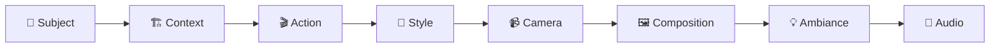

Title: Live Content

Description: Fetched live

Source: https://raw.githubusercontent.com/snubroot/Veo-3-Prompting-Guide/main/README.md

---

```
   _____ _   _ _    _ ____  _____   ____   ____ _______
  / ____| \ | | |  | |  _ \|  __ \ / __ \ / __ \__   __|
 | (___ |  \| | |  | | |_) | |__) | |  | | |  | | | |
  \___ \| . ` | |  | |  _ <|  _  /| |  | | |  | | | |
  ____) | |\  | |__| | |_) | | \ \| |__| | |__| | | |
 |_____/|_| \_|\____/|____/|_|  \_\\____/ \____/  |_|

```

<div align="center">

# 🎬 **GOOGLE VEO 3 MASTER PROMPTING GUIDE**
### *The Ultimate Professional Resource for AI Video Generation*

[](https://github.com/snubroot)
[](https://github.com/snubroot)
[](https://github.com/snubroot)
[](https://github.com/snubroot)

*Created by **snubroot** - The definitive guide to professional Veo 3 video generation*

---

</div>

## 📋 **TABLE OF CONTENTS**

### 🚀 **GETTING STARTED**
- [📖 Introduction to Veo 3](#-introduction-to-veo-3)
- [⚡ Key Capabilities](#-key-capabilities)
- [🎯 Professional Prompt Structure](#-professional-prompt-structure)

### 🎥 **CORE TECHNIQUES**
- [🎬 Advanced Prompting Practices](#-advanced-prompting-practices)
  - [📹 Professional Cinematography](#41-professional-cinematography-prompting)
  - [🎭 Style and Genre Prompting](#42-style-and-genre-prompting)
  - [⚙️ Technical Specifications](#43-advanced-technical-specifications)
  - [💫 Narrative and Emotional Prompting](#44-narrative-and-emotional-prompting)
  - [🎯 Shot Composition Mastery](#45-shot-composition-mastery)
  - [💡 Professional Lighting](#46-professional-lighting-mastery)
  - [🎪 Advanced Visual Effects](#47-advanced-visual-effects-prompting)
  - [📷 Master Camera Movement Library](#48-master-camera-movement-library)
  - [🔥 **CRITICAL Camera Positioning**](#-critical-camera-positioning-breakthrough)
  - [🤳 Advanced Selfie Video Mastery](#411-advanced-selfie-video-mastery)
  - [🎮 Advanced Movement Quality Control](#412-advanced-movement-quality-control)

### 🎵 **AUDIO MASTERY**
- [🔊 Audio and Dialogue Integration](#-audio-and-dialogue-integration)
  - [🎤 Revolutionary Native Audio](#21-revolutionary-native-audio-prompting)
  - [💬 Battle-Tested Dialogue Techniques](#211-battle-tested-dialogue-techniques)
  - [🎬 Advanced Sequence Prompting](#212-advanced-sequence-prompting)
  - [🎼 Advanced Audio Categorization](#61-advanced-audio-categorization)
  - [🔧 Advanced Audio Quality Control](#62-advanced-audio-quality-control)

### 🛠️ **PROFESSIONAL WORKFLOWS**
- [❌ Negative and Refinement Prompts](#-negative-and-refinement-prompts)
- [📱 Platform-Specific Considerations](#-platform-specific-considerations)
  - [📱 Vertical Video Workaround](#81-vertical-video-workaround)
  - [🎥 Professional Video Enhancement](#82-professional-video-enhancement)
  - [⚡ Professional Workflow Optimization](#83-professional-workflow-optimization)

### 📚 **EXAMPLE LIBRARY**
- [🎯 Example Professional Prompts](#-example-professional-prompts)
- [🏢 Corporate and Business](#10-corporate-and-business-video-templates)
- [📚 Educational Content](#11-educational-content-templates)
- [📈 Marketing and Social Media](#12-marketing-and-social-media-templates)
- [🎨 Creative and Artistic](#13-creative-and-artistic-templates)
- [🔧 Technical and Tutorial](#14-technical-and-tutorial-templates)

### 🧠 **ADVANCED SYSTEMS**
- [🧮 Advanced Reasoning Frameworks](#15-advanced-reasoning-frameworks-for-veo-3)
- [🏢 Enterprise Meta Prompt Workflows](#16-enterprise-meta-prompt-workflows)
  - [🛠️ Expert Troubleshooting Solutions](#161-expert-troubleshooting-solutions)
  - [🤖 Universal Meta Prompt Engine](#162-universal-meta-prompt-engine---master-level-cognitive-architecture)

### 📖 **REFERENCE**
- [📚 Resources and References](#-resources-and-references)

---

<div align="center">

## 🌟 **WHAT'S NEW IN VERSION 4.0**

</div>

| Feature | Status | Description |
|---------|--------|--------------|
| 🔥 **Critical Camera Positioning** | ✅ NEW | Revolutionary `"(thats where the camera is)"` syntax |
| 🤳 **Selfie Video Mastery** | ✅ NEW | Proven formulas for authentic selfie behavior |
| 🎵 **Audio Categorization** | ✅ NEW | Professional audio libraries and quality control |
| 🎮 **Movement Quality Control** | ✅ NEW | Precision keywords for natural, energetic, graceful motion |
| 🛠️ **Expert Troubleshooting** | ✅ NEW | Battle-tested solutions for common generation issues |
| 📱 **Vertical Video Workaround** | ✅ NEW | Professional solution for 9:16 format |
| 🎨 **Advanced Composition** | ✅ NEW | Lens effects, color palettes, cinematic grading |
| ⚡ **Workflow Optimization** | ✅ NEW | Professional upscaling and format conversion tools |
| 🤖 **Meta Prompt Engine** | ✅ ENHANCED | Master-level cognitive architecture for prompt generation |

---

---

<div align="center">

## 📖 **INTRODUCTION TO VEO 3**

</div>

> **Google Veo 3** is the world's most advanced text-to-video AI model, capable of generating cinematic-quality videos with synchronized audio, realistic physics, and professional-grade visual effects.

### 🌟 **What Makes Veo 3 Revolutionary**

Google Veo 3 represents a quantum leap in AI video generation technology, enabling creators to produce **broadcast-quality content** from detailed text descriptions. Unlike previous models, Veo 3 generates **video and audio simultaneously**, ensuring perfect synchronization and professional results.

### 🚀 **Platform Access**

| Platform | Access Level | Features |
|----------|--------------|----------|
| **Vertex AI** | Enterprise | Full API access, batch processing, public preview |
| **Google Vids** | Consumer | Simplified interface, templates |
| **Gemini App** | General | Basic generation, mobile-friendly |

### ⚡ **Generation Modes**

- **🏃‍♂️ Fast Generate**: Quick generation for rapid prototyping and iteration (veo-3.0-fast-generate-preview)
- **💎 Standard Generate**: Maximum quality for final production use (veo-3.0-generate-preview)

<div align="center">

## ⚡ **KEY CAPABILITIES**

</div>

### 🎤 **Revolutionary Audio Integration**
- 🎵 **Native Audio Generation**: Generates synchronized video and audio in a single pass
- 💬 **Perfect Lip-Sync**: Dialogue generation with precise mouth movement synchronization
- 🎼 **Environmental Audio**: Ambient sounds, music, and sound effects automatically matched to visuals
- 🔊 **Professional Audio Quality**: Broadcast-standard audio mixing and clarity

### 🎥 **Cinematic Video Generation**
- 📺 **High-Definition Resolution**: 720p (default) and 1080p video generation
- 🎬 **Professional Cinematography**: Advanced camera movements, lighting, depth of field
- 🎆 **Visual Effects**: Particle systems, atmospheric effects, realistic materials
- 🎨 **Artistic Styles**: Support for multiple visual aesthetics and film genres

### 🧪 **Advanced Physics Simulation**
- 💧 **Realistic Fluids**: Water, liquids, and particle behavior following natural physics
- 🌊 **Gravity Systems**: Accurate falling, bouncing, and momentum conservation
- 🧵 **Material Properties**: Fabric, metal, glass, and organic material simulation
- ✨ **Particle Effects**: Smoke, fire, dust, and atmospheric particles

### 👥 **Character and Scene Mastery**
- 🎭 **Character Consistency**: Maintain visual continuity across multiple generations
- 👥 **Multi-Character Scenes**: Complex interactions between multiple subjects
- 🏗️ **Scene Understanding**: Temporal sequences and narrative continuity
- 🔄 **Multi-Modal Input**: Text-to-video, image-to-video, video-to-video generation

## 2.1 Revolutionary Native Audio Prompting

### Dialogue Generation with Lip-Sync
Veo 3's breakthrough feature is generating perfectly synchronized dialogue. Use these techniques:

**Direct Dialogue Prompting:**
```
The teacher stands at the whiteboard and says: "Today we'll explore photosynthesis, the process plants use to convert sunlight into energy."
```

**Conversational Dialogue:**
```
The woman asks: "Where should we meet for lunch?" The man replies: "How about that new Italian place downtown?"
```

**Emotional Dialogue:**
```
The CEO pauses thoughtfully, then says with conviction: "This is the direction our company needs to go." Her voice carries determination mixed with slight uncertainty.
```

### Environmental Audio Prompting

**Layered Soundscapes:**
```
Audio: Distant traffic hum, occasional car horns, footsteps on pavement, muffled conversations, city ambiance with subtle building echoes.
```

**Natural Environments:**
```
Audio: Gentle wind through trees, various bird songs, rustling leaves, distant water flowing, peaceful forest atmosphere.
```

**Professional Settings:**
```
Audio: Soft keyboard typing, air conditioning hum, muffled phone conversations, paper rustling, professional office ambiance.
```

### Music Integration Prompting

**Mood-Based Music:**
```
Audio: Uplifting orchestral music with strings and brass, building to an inspiring crescendo, conveying hope and determination.
```

**Genre-Specific Scoring:**
```
Audio: Soft jazz piano with subtle bass line, creating sophisticated, intimate atmosphere reminiscent of a high-end lounge.
```

**Dynamic Musical Development:**
```
Audio: Tension-building electronic music starting minimal, adding layers of synths and percussion, reaching climax as the character makes their decision.
```

### Sound Effects Prompting

**Action-Synchronized Audio:**
```
Audio: Sizzling oil in pan, knife chopping vegetables, water boiling, utensils clinking, kitchen cooking ambiance.
```

**Movement and Impact Sounds:**
```
Audio: Footsteps running on gravel, heavy breathing, door slamming, car engine starting, tires screeching.
```

**Technology and Interface Sounds:**
```
Audio: Device startup chime, button clicks, screen interface sounds, notification alerts, modern tech ambiance.
```

## 2.1.1 Battle-Tested Dialogue Techniques

### Proven Dialogue Syntax (Community-Verified)

**✅ WORKS - Colon Format (Prevents Subtitles):**
```
The detective looks directly at camera and says: "Something's not right here." His voice carries suspicion and determination.
```

**❌ FAILS - Quote Format (Causes Subtitles):**
```
The detective says: "Something's not right here." (Avoid this format)
```

### Phonetic Pronunciation Fixes

**Problem**: AI mispronounces names or complex words
**Solution**: Use phonetic spelling

```
Original: "Read on to get Fofur and Shridar's guidance"
Fixed: "Read on to get foh-fur's and Shreedar's guidance"
```

### Dialogue Length Optimization

**Perfect Length (8-second rule):**
```
Sarah, a confident CEO, looks at camera and says: "Our Q3 results exceeded all expectations, positioning us for unprecedented growth."
```

**Too Long (Causes rushed speech):**
```
Avoid: Long paragraphs that require 15+ seconds to speak naturally
```

**Too Short (Causes silence/gibberish):**
```
Avoid: Single words like "Hello" or "Yes"
```

### Multi-Character Dialogue Control

**Specify Who Speaks When:**
```
The woman in the red dress asks: "Where should we meet for lunch?" The man in the blue shirt replies: "How about that new Italian place downtown?"
```

**Character-Specific Dialogue:**
```
The woman wearing pink says: "But I'm the one who's wearing pink." The man with glasses replies: "No, I'm the one with the glasses."
```

### AI-Generated Dialogue Prompts

**Let Veo 3 Create Natural Dialogue:**
```
- A standup comic tells a joke
- Two people discuss a movie they just watched
- A man argues passionately over the phone
- A woman shares her inspiring life story
- A teacher explains a complex concept to students
```

### Subtitle Prevention Techniques (Proven Methods)

**Method 1 - Colon Format:**
```
Use: Character says: "dialogue" (with colon before dialogue)
Avoid: Character says "dialogue" (no colon - triggers subtitles)

KEY: The colon (:) prevents subtitle generation
```

**Method 2 - Explicit Negation:**
```
Add to prompt: "(no subtitles)" or "no subtitles, no text overlays"
```

**Method 3 - Multiple Negatives (For Stubborn Cases):**
```
"No subtitles. No subtitles! No on-screen text whatsoever."
```

### Audio Hallucination Fixes

**Problem**: Unwanted "live studio audience" laughter
**Solution**: Always specify expected background audio

```
Bad: Character tells a joke (may add unwanted laughter)
Good: Character tells a joke. Audio: quiet office ambiance, no audience sounds, professional atmosphere.
```

**Environmental Audio Specification:**
```
Audio: sounds of distant bands, noisy crowd, ambient background of a busy festival field (prevents wrong audio hallucinations)
```

## 2.1.2 Advanced Sequence Prompting

### "This Then That" Technique (Community Discovery)

**Emotional Progression:**
```
The character starts confused and uncertain, then gradually becomes confident and determined, finally ending with a satisfied smile of accomplishment.
```

**Action Sequences:**
```
She first hesitates at the door, then takes a deep breath, finally pushes it open with resolve.
```

**Camera Movement Sequences:**
```
The scene begins with a wide establishing shot, then smoothly transitions to a medium shot at the 3-second mark, finally ending with a close-up on the character's determined expression.
```

### Micro-Expression Control (Professional Technique)

**Subtle Emotional Indicators:**
```
His eyes narrow slightly, a small furrow appears between his brows, and he pauses for just a moment before speaking.
```

**Dynamic Character Life:**
```
He steps forward a half-step, raises his chin, eyes focused, inviting conflict.
```

**Eliminating "Model Face":**
```
Eyes squint thoughtfully, head tilts as if processing new information, slight smile begins to form.
```

## 2.2 Advanced Physics Simulation Prompting

### Fluid Dynamics Prompting
Veo 3 excels at realistic water and liquid behavior. Use specific physics terminology:

**Water Flow and Splashes:**
```
A glass of water tips over, with realistic physics governing the liquid's flow. Water spreads across the table surface following natural fluid dynamics, creating authentic splash patterns and surface reflections.
```

**Advanced Fluid Behavior:**
```
Rain drops hit the window, each droplet following realistic physics as they merge, streak down the glass surface, and create natural water trails with proper surface tension effects.
```

### Material Physics Prompting

**Fabric and Cloth Simulation:**
```
A silk scarf falls through the air, its lightweight fabric floating and billowing naturally with air resistance, landing softly with realistic draping and fold patterns.
```

**Rigid Body Physics:**
```
Two billiard balls collide with accurate momentum transfer, the impact creating realistic sound and motion as they separate at proper angles based on physics principles.
```

**Particle System Effects:**
```
Smoke rises from the campfire in realistic wisps, particles dispersing naturally with wind currents, creating volumetric lighting effects as sunlight filters through.
```

### Gravity and Motion Prompting

**Natural Falling Motion:**
```
Leaves fall from the tree, each following realistic physics with natural rotation, air resistance affecting their descent speed, and authentic landing patterns.
```

**Complex Mechanical Motion:**
```
The pendulum swings with accurate physics, showing proper momentum conservation, gradual energy loss, and realistic oscillation patterns.
```

## 2.3 Character Consistency Prompting

### Character Template Framework
Maintain visual continuity across scenes with detailed character descriptions:

**Comprehensive Character Template:**
```
[NAME], a [AGE] [ETHNICITY] [GENDER] with [SPECIFIC_HAIR_DETAILS], [EYE_COLOR] eyes, [DISTINCTIVE_FACIAL_FEATURES], wearing [DETAILED_CLOTHING_DESCRIPTION], with [POSTURE_AND_MANNERISMS]
```

**Example Character Consistency:**
```
Sarah Chen, a 32-year-old Asian-American woman with shoulder-length black hair styled in a professional bob, warm brown eyes behind wire-rimmed glasses, wearing a charcoal gray blazer over a white collared shirt, with confident posture and an approachable smile that creates small crinkles around her eyes.
```

### Multi-Scene Character Continuity

**Scene 1 - Character Introduction:**
```
Dr. Jennifer Walsh, a 35-year-old pediatrician with short brown hair in a bob cut, kind green eyes, and a warm smile, wearing a white lab coat over blue scrubs with a stethoscope around her neck. She examines a young patient in a bright examination room.
```

**Scene 2 - Same Character, Different Setting:**
```
Dr. Jennifer Walsh, the same 35-year-old pediatrician with short brown hair in a bob cut and kind green eyes, now wearing a casual green sweater and dark jeans, sits at her home office desk reviewing patient files. She maintains her characteristic warm, caring expression.
```

### Signature Element Consistency

**Distinctive Accessories:**
```
The detective always wears his vintage leather jacket, silver watch on his left wrist, and carries a worn brown leather notebook. These signature elements appear in every scene.
```

**Behavioral Consistency:**
```
The professor has a habit of adjusting his glasses when thinking deeply, gesturing with his hands while explaining concepts, and maintaining an enthusiastic, engaging demeanor.
```

## 3. Professional Prompt Structure
<div align="center">

## 🎯 **PROFESSIONAL PROMPT STRUCTURE**

</div>

> **Master the 8-Component Framework** that transforms basic descriptions into cinematic masterpieces

### 🏆 **The Professional Formula**



### 📝 **Component Breakdown**

| Component | 🎯 Purpose | ✨ Example |
|-----------|---------|----------|
| **👤 Subject** | Main focus and character details | *"A confident 35-year-old CEO with short auburn hair"* |
| **🏗️ Context** | Scene setting and environment | *"in a modern glass-walled boardroom at sunset"* |
| **🎬 Action** | What's happening in the scene | *"she presents quarterly results with animated gestures"* |
| **🎨 Style** | Visual aesthetic and genre | *"cinematic corporate style with warm color grading"* |
| **📹 Camera** | Shot type and movement | *"smooth dolly-in from medium to close-up shot"* |
| **🖼️ Composition** | Framing and visual structure | *"rule of thirds, subject left-positioned, bokeh background"* |
| **💡 Ambiance** | Lighting, mood, and atmosphere | *"golden hour light through windows, professional warmth"* |
| **🎵 Audio** | Sound design and dialogue | *"she says: 'Our Q3 results exceeded all expectations'"* |

### 📊 **Quality Hierarchy**

```
🥇 MASTER LEVEL    = All 8 components + advanced techniques
🥈 PROFESSIONAL   = 6-8 components with detailed descriptions
🥉 INTERMEDIATE   = 4-6 components with basic details
⚠️  BASIC         = 1-3 components (poor results)
```

### 🔥 **Pro Tips for Each Component**

<details>
<summary><strong>👤 Subject Mastery</strong></summary>

- Include **15+ specific physical attributes**
- Specify age, ethnicity, build, facial features
- Detail clothing, accessories, and distinctive marks
- Add personality indicators through posture/expression

**Example**: *"Sarah Chen, a 32-year-old Asian-American woman with shoulder-length black hair in a professional bob, warm brown eyes behind wire-rimmed glasses, wearing a charcoal gray blazer over white collared shirt, confident posture with an approachable smile"*
</details>

<details>
<summary><strong>🏗️ Context Excellence</strong></summary>

- Describe location with architectural details
- Include props, furniture, and background elements
- Specify time of day and weather conditions
- Add environmental storytelling elements

**Example**: *"in a modern tech startup office with exposed brick walls, standing desks, multiple monitors, plants, and large windows showing a bustling city street at golden hour"*
</details>

<details>
<summary><strong>🎬 Action Precision</strong></summary>

- Use vivid, specific verbs
- Include micro-expressions and gestures
- Specify timing and sequence
- Add emotional undertones

**Example**: *"she gestures enthusiastically toward the presentation screen, pauses thoughtfully while reviewing data, then turns to the camera with a confident smile and slight head tilt"*
</details>

<div align="center">

## 🎬 **ADVANCED PROMPTING PRACTICES**

</div>

> **Master-level techniques** for creating broadcast-quality videos with professional cinematography, advanced physics, and cinematic storytelling

---

### 4.1 Professional Cinematography Prompting

**Camera Movement Techniques:**
- **Dolly shots**: "Smooth dolly-in from wide to medium shot"
- **Tracking shots**: "Camera tracks alongside the character as they walk"
- **Crane movements**: "High crane shot descending to eye level"
- **Handheld style**: "Subtle handheld camera movement for documentary feel"
- **Gimbal stabilization**: "Smooth gimbal movement following the action"

**Shot Composition Mastery:**
```
Wide establishing shot of the modern office building, then cut to medium shot of the executive at her desk, finally close-up on her confident expression as she makes the decision.
```

**Advanced Lighting Control:**
```
Cinematic lighting with key light from camera left, subtle fill light to soften shadows, and rim lighting to separate subject from background. Golden hour warmth with professional color grading.
```

**Depth of Field Techniques:**
```
Shallow depth of field with subject in sharp focus, background naturally blurred with beautiful bokeh. Rack focus from foreground object to character's face at the 4-second mark.
```

### 4.2 Style and Genre Prompting

**Film Noir Style:**
```
Film noir cinematography with dramatic chiaroscuro lighting, deep shadows, venetian blind light patterns, and high contrast black and white aesthetic.
```

**Documentary Style:**
```
Documentary-style handheld camera work, natural lighting, authentic interactions, and observational cinematography that captures genuine moments.
```

**Commercial Production Style:**
```
High-end commercial production values with perfect lighting, smooth camera movements, vibrant colors, and polished professional aesthetic.
```

**Cinematic Blockbuster Style:**
```
Epic cinematic style with dramatic wide shots, dynamic camera movements, rich color grading, and theatrical lighting reminiscent of major Hollywood productions.
```

### 4.3 Advanced Technical Specifications

**Resolution and Format Control:**
- **Aspect Ratios**: "16:9 for YouTube", "9:16 for TikTok", "1:1 for Instagram"
- **Quality Settings**: "1080p resolution for maximum quality"
- **Color Specifications**: "Professional color grading and cinematic aesthetics"

**Professional Workflow Integration:**
```
Shot designed for professional post-production workflow, with proper exposure latitude, clean audio levels, and color grading-friendly lighting setup.
```

### 4.4 Narrative and Emotional Prompting

**Emotional Arc Development:**
```
The character's expression transitions from uncertainty to growing confidence, with lighting gradually warming and camera slowly moving closer to reflect the emotional transformation.
```

**Micro-Expression Control:**
```
Subtle facial expressions showing internal conflict - slight furrow of the brow, momentary pause before speaking, eyes that convey both determination and vulnerability.
```

**Environmental Storytelling:**
```
The cluttered desk with multiple coffee cups and scattered papers tells the story of long work hours, while the family photo positioned prominently reveals personal motivation.
```

### 4.5 Multi-Element Scene Coordination

**Complex Scene Management:**
```
As the main character delivers her presentation, background colleagues continue natural office activities - typing, phone conversations, walking past - creating authentic workplace atmosphere while maintaining focus on the speaker through selective focus and composition.
```

**Temporal Sequencing:**
```
The scene begins with a wide establishing shot, smoothly transitions to a medium shot at the 3-second mark, then ends with a close-up focus on the character's determined expression, each transition motivated by the narrative flow.
```

### 4.6 Advanced Audio-Visual Synchronization

**Dialogue and Action Coordination:**
```
As she says "This is our moment," the character stands from her chair, the camera rising with her movement, while inspirational music builds to emphasize the pivotal moment.
```

**Environmental Audio Matching:**
```
The busy restaurant scene includes layered audio of clinking glasses, muffled conversations, kitchen sounds, and soft background music, all balanced to support the intimate conversation between the main characters.
```

### 4.7 Negative Prompting Mastery

**Comprehensive Negative Prompts:**
```
Negative prompt: no text overlays, no watermarks, no cartoon effects, no unrealistic proportions, no blurry faces, no distorted hands, no artificial lighting, no oversaturation.
```

**Quality Control Negatives:**
```
Negative prompt: no low resolution artifacts, no compression noise, no camera shake, no poor audio quality, no lip-sync issues, no unnatural movements.
```

## 4.8 Master Camera Movement Library

### Static/Fixed Shots

**Keywords**: `static shot`, `fixed camera`, `locked-off shot`
**Visual Effect**: Provides stability and focus; allows viewers to absorb scene details
**When to Use**: Establishing shots, dialogue scenes, detail focus

```
Static wide shot establishing the ancient library, camera remains perfectly still as the scholar enters and begins reading.
```

### Pan Movements

**Keywords**: `pan left`, `pan right`, `slow pan`, `fast pan`, `whip pan`
**Visual Effect**: Reveals information gradually, builds anticipation, shows expanse
**When to Use**: Revealing landscapes, following horizontal action, creating suspense

```
Slow right-to-left pan across the alien landscape, revealing the mysterious structures in the distance.
```

### Tilt Movements

**Keywords**: `tilt up`, `tilt down`, `vertical tilt`
**Visual Effect**: Reveals vertical relationships, emphasizes scale, creates drama
**When to Use**: Showing building height, character emotions, dramatic reveals

```
Upward tilt from the character's worn boots to their determined expression, emphasizing their resolve.
```

### Tracking/Follow Shots

**Keywords**: `tracking shot`, `follow shot`, `lateral tracking`, `smooth tracking`
**Visual Effect**: Creates dynamic movement, maintains subject focus, provides spatial awareness
**When to Use**: Following characters in motion, action sequences, creating energy

```
Smooth tracking shot following the dancer across the stage, camera moving fluidly with their graceful movements.
```

### Dolly Movements

**Keywords**: `dolly in`, `dolly out`, `slow dolly`, `push in`, `pull back`
**Visual Effect**: Creates intimacy or detachment, emphasizes subject or reveals context
**When to Use**: Building tension, revealing information, emotional connection

```
Slow dolly-in on the mysterious artifact as it begins to glow, drawing the viewer into the magical moment.
```

### Zoom Effects

**Keywords**: `zoom in`, `zoom out`, `slow zoom`, `crash zoom`, `dramatic zoom`
**Visual Effect**: Changes field of view, creates focus, tension, or dramatic reveal
**When to Use**: Dramatic emphasis, revealing details, creating intensity

```
Dramatic zoom in on the villain's eyes as they narrow, building tension for the confrontation.
```

### Crane/Aerial Shots

**Keywords**: `crane shot`, `jib shot`, `camera rises`, `camera descends`, `high crane`
**Visual Effect**: Offers dramatic perspective changes, establishes scope, creates emotional peaks
**When to Use**: Epic reveals, establishing scale, dramatic transitions

```
High crane shot pulling back to reveal the entire city skyline at night, emphasizing the character's isolation.
```

### Angle Variations

**Keywords**: `high angle`, `low angle`, `bird's-eye view`, `worm's-eye view`, `eye level`
**Visual Effect**: Influences perception of power, vulnerability, provides unique perspectives
**When to Use**: Character dynamics, creating mood, unique viewpoints

```
Low angle shot of the towering monster, emphasizing its massive scale and the hero's vulnerability.
```

### Handheld Styles

**Keywords**: `handheld camera`, `shaky camera`, `slight handheld movement`, `documentary style`
**Visual Effect**: Creates realism, immediacy, tension, documentary feel
**When to Use**: Action sequences, emotional scenes, realistic narratives

```
Handheld camera with subtle shake, following the journalist through the chaotic protest, creating immediacy and realism.
```

### Specialty Movements

**Keywords**: `orbit shot`, `arc shot`, `360-degree`, `fly through`, `circular movement`
**Visual Effect**: Showcases subjects from multiple angles, creates immersive experiences
**When to Use**: Product showcases, magical moments, immersive storytelling

```
360-degree orbit shot around the levitating crystal, revealing its intricate details from every angle.
```

### 🔥 CRITICAL CAMERA POSITIONING BREAKTHROUGH

**Revolutionary Discovery**: The most important camera technique discovered by expert practitioners.

**CRITICAL RULE**: Always include `"(thats where the camera is)"` when specifying camera position.

**Why This Works**: Veo 3 requires explicit camera positioning rather than generic viewpoint terms. This phrase triggers camera-aware processing and dramatically improves generation success rates.

**Expert Camera Position Templates**:
```
"Expert [PROFESSION] is holding a phone at arm's length (thats where the camera is) in [RELEVANT WORKSPACE], demonstrating [SPECIFIC TECHNIQUE], professional lighting, confident movement."

"POV shot from the camera positioned at eye level (thats where the camera is) as the character explains the process."

"Over-the-shoulder view with camera behind the interviewer (thats where the camera is), focusing on the subject's responses."
```

**Before vs After Examples**:

❌ **Poor**: "Close-up shot of the chef cooking"
✅ **Expert**: "Close-up shot with camera positioned at counter level (thats where the camera is) as the chef demonstrates knife techniques"

❌ **Poor**: "Handheld camera following the subject"
✅ **Expert**: "Handheld camera held at chest height (thats where the camera is) tracking the subject as they walk through the market"

## 4.9 Advanced Shot Composition Mastery

### Shot Sizes and Framing

**Extreme Wide Shot (EWS)**:
```
Extreme wide shot of the lone figure walking across the vast desert landscape, emphasizing isolation and scale.
```

**Wide Shot (WS)**:
```
Wide shot of the family gathered around the dinner table, showing the warm, intimate setting.
```

**Medium Wide Shot (MWS)**:
```
Medium wide shot of the detective examining evidence, showing both character and environment context.
```

**Medium Shot (MS)**:
```
Medium shot of the CEO presenting to the board, framing from waist up for professional authority.
```

**Medium Close-Up (MCU)**:
```
Medium close-up of the artist's focused expression while painting, capturing concentration and skill.
```

**Close-Up (CU)**:
```
Close-up of the character's eyes widening in realization, emphasizing the emotional breakthrough.
```

**Extreme Close-Up (ECU)**:
```
Extreme close-up of the ancient key turning in the lock, highlighting the crucial moment.
```

### Advanced Framing Techniques

**Rule of Thirds**:
```
Frame the lighthouse positioned on the right third of the composition, with the stormy ocean filling the left two-thirds.
```

**Leading Lines**:
```
The winding path leads the eye from the foreground to the mysterious castle in the background.
```

**Depth of Field Control**:
```
Shallow depth of field with the subject in sharp focus, background naturally blurred with beautiful bokeh.
```

**Rack Focus**:
```
Rack focus from the foreground flower to the character's face in the background, shifting narrative attention.
```

### Advanced Lens and Focus Effects

**Precision Lens Control**: Professional-grade lens effects for cinematic results.

**Lens Effect Keywords**:
```
"shallow depth of field" - Isolates subjects with beautiful bokeh
"deep focus" - Keeps everything in sharp focus
"rack focus" - Shifts focus dramatically between subjects
"soft focus" - Creates dreamy, ethereal looks
"macro lens" - Shows intricate tiny details
"wide-angle lens" - Expands perspective and space
"lens flare" - Adds cinematic light effects
```

**Advanced Focus Examples**:
```
Shallow depth of field with the subject in sharp focus, background naturally blurred with beautiful bokeh, creating professional portrait aesthetic.

Deep focus maintaining clarity from foreground to background, allowing viewers to see all environmental details simultaneously.

Rack focus transition from the product in foreground to the character's reaction in background, directing viewer attention narratively.
```

### Professional Color Palette Control

**Cinematic Color Grading**: Precise control over visual mood and aesthetic.

**Color Palette Keywords**:
```
"monochromatic" - Single color scheme for artistic unity
"vibrant colors" - High saturation for energetic feel
"pastel tones" - Soft, muted colors for gentle mood
"desaturated" - Reduced color intensity for serious tone
"sepia tone" - Vintage brown tinting for nostalgic feel
"cool blue palette" - Cold color scheme for modern/tech feel
"warm orange tones" - Warm color scheme for comfort/intimacy
```

**Color Grading Examples**:
```
Cinematic color grading with warm orange tones in highlights and cool blue shadows, creating professional film aesthetic with emotional depth.

Desaturated color palette with selective color emphasis on the red rose, drawing attention while maintaining artistic sophistication.

Vibrant colors with high saturation creating energetic, social media-optimized aesthetic perfect for engaging younger audiences.
```

### Advanced Perspective and Distortion Effects

**Wide-Angle Lens Simulation**:
```
Wide-angle perspective creating slight distortion at the edges, emphasizing the cramped apartment space.
```

**Telephoto Lens Simulation**:
```
Telephoto lens compression effect, flattening the background and isolating the subject from the environment.
```

**Fish-Eye Effect**:
```
Fish-eye lens distortion creating a surreal, curved perspective of the underground tunnel.
```

## 4.10 Professional Lighting Mastery

### Classic Lighting Setups

**Three-Point Lighting**:
```
Professional three-point lighting with warm key light from camera left, subtle fill light to soften shadows, and rim lighting to separate subject from background.
```

**Rembrandt Lighting**:
```
Rembrandt lighting creating a distinctive triangle of light on the shadow side of the face, adding dramatic character.
```

**Butterfly Lighting**:
```
Butterfly lighting with the key light directly in front and above, creating a small shadow under the nose.
```

### Mood and Atmosphere Lighting

**Golden Hour**:
```
Warm golden hour lighting filtering through the windows, creating a nostalgic, peaceful atmosphere.
```

**Blue Hour**:
```
Cool blue hour lighting with deep twilight colors, creating a mysterious and contemplative mood.
```

**Chiaroscuro**:
```
Dramatic chiaroscuro lighting with stark contrasts between light and shadow, creating film noir atmosphere.
```

**Neon Lighting**:
```
Vibrant neon lighting in magenta and cyan, reflecting off wet pavement in the cyberpunk alley.
```

### Natural Lighting Scenarios

**Window Light**:
```
Soft, natural window lighting creating gentle shadows and highlighting the subject's contemplative expression.
```

**Candlelight**:
```
Warm, flickering candlelight casting dancing shadows on the walls, creating an intimate, romantic atmosphere.
```

**Firelight**:
```
Orange firelight from the campfire illuminating faces with warm, flickering light and deep shadows.
```

## 4.11 Advanced Selfie Video Mastery

**Revolutionary Technique**: Specific phrases consistently unlock authentic selfie behavior in Veo 3.

### Proven Selfie Formula

**Core Structure**:
```
"A selfie video of [CHARACTER]..."
+ "holds the camera at arm's length"
+ "His/her [body part] arm is clearly visible in the frame"
+ "occasionally looking into the camera before [ACTION]"
+ "The image is slightly grainy, looks very film-like"
```

### Expert Selfie Template

```
A selfie video of a [CHARACTER_DESCRIPTION] exploring [LOCATION]. [He/She] is wearing [CLOTHING] and has [EMOTION] in [his/her] eyes. [LIGHTING_DESCRIPTION]. [He/She] is [ACTIVITY] while talking, occasionally looking into the camera before [SPECIFIC_ACTION]. The image is slightly grainy, looks very film-like. [He/She] speaks in a [ACCENT] and says: "[DIALOGUE_8_SECONDS_MAX]" [He/She] ends with [GESTURE].
```

### Battle-Tested Selfie Examples

**Travel Vlog Style**:
```
A selfie video of a travel blogger exploring a bustling Tokyo street market. She's wearing a vintage denim jacket and has excitement in her eyes. The afternoon sun creates beautiful shadows between the vendor stalls. She's sampling different street foods while talking, occasionally looking into the camera before turning to point at interesting stalls. The image is slightly grainy, looks very film-like. She speaks in a British accent and says: "Okay, you have to try this place when you visit Tokyo. The takoyaki here is absolutely incredible, and the vendor just told me it's been in his family for three generations." She ends with a thumbs up.
```

**POV Adventure Style**:
```
A handheld selfie-style shot, from the point-of-view of a gorilla in a lush jungle. A large silverback gorilla holds the camera at arm's length. His long, powerful arm is clearly visible in the frame, and his face is perfectly framed. The gorilla says: "I'm just testing out this actually works and I'm going to post it on TikTok later, Essentially it felt cute might delete it later" (lips moving like he's saying it)
```

### Critical Selfie Success Elements

1. **Start with "A selfie video of..."** - This phrase is crucial for triggering selfie behavior
2. **Make the arm visible** - "His/her arm is clearly visible in the frame" adds authenticity
3. **Natural eye movement** - "occasionally looking into the camera before [action]" creates realistic behavior
4. **Film-like quality** - "slightly grainy, looks very film-like" prevents AI-clean appearance
5. **Specific gestures** - End with thumbs up, wave, or other natural selfie gestures

## 4.12 Advanced Movement Quality Control

**Precision Movement Keywords**: Control exactly how subjects move and behave.

### Movement Quality Specifications

```
"natural movement" - Default, realistic human motion
"energetic movement" - Dynamic, high-energy actions
"slow and deliberate movement" - Thoughtful, careful actions
"graceful movement" - Smooth, flowing motion
"confident movement" - Assured, purposeful actions
"fluid movement" - Seamless, continuous motion
```

### Camera Movement Integration

When combining subject movement with camera movement:

```
"tracking shot" - Camera follows the subject smoothly
"dolly-in" - Camera moves closer during action
"panning left to right" - Camera sweeps across scene
"smooth gimbal movement" - Professional stabilized motion
"handheld tracking" - Documentary-style following
```

### Advanced Movement Examples

**Confident Professional**:
```
The executive walks with confident movement across the modern office, camera tracking smoothly at eye level (thats where the camera is), maintaining professional framing as she approaches the presentation screen.
```

**Graceful Demonstration**:
```
The chef demonstrates knife techniques with graceful movement, camera positioned at counter level (thats where the camera is) with a slow dolly-in to capture the precise cutting motion.
```

**Energetic Social Media**:
```
The fitness instructor demonstrates the workout with energetic movement, handheld camera at chest height (thats where the camera is) creating dynamic, engaging footage perfect for social media.
```

## 5. Example Professional Prompts
> "A middle-aged man in a tailored navy suit stands on a rain-soaked city street at night, illuminated by neon signs and passing car headlights. He holds a black umbrella and checks his vintage wristwatch. The scene is shot in the style of a neo-noir film, with high contrast lighting, deep shadows, and reflections on the wet pavement. Slow tracking camera movement, medium shot, subject slightly off-center. The ambiance is moody and tense, with cool blue and purple tones.\nAudio: Ambient city sounds, rain falling, distant sirens. The man mutters, 'Not tonight…' under his breath."

> "A golden retriever puppy runs through a field of wildflowers at sunrise, petals scattering in the air. Shot in ultra slow motion, close-up, with shallow depth of field. The lighting is soft and golden.\nAudio: Gentle piano music, birds chirping, puppy's excited barks."

### 5.1 Professional Prompt Templates

**Corporate Executive Template:**
```
[EXECUTIVE_NAME], a [AGE] [ETHNICITY] [GENDER] in [PROFESSIONAL_ATTIRE], stands confidently in [CORPORATE_ENVIRONMENT]. [SPECIFIC_ACTION] while [DIALOGUE]. Professional lighting with [LIGHTING_SETUP]. 

Camera: [CAMERA_MOVEMENT] maintaining professional framing.
Audio: Clear, authoritative voice with [BACKGROUND_AMBIANCE].
Style: Corporate, polished, [SPECIFIC_AESTHETIC].
```

**Product Showcase Template:**
```
[PRODUCT] elegantly positioned on [SURFACE] against [BACKGROUND]. [LIGHTING_DESCRIPTION] highlights key features. [CAMERA_MOVEMENT] reveals product details.

Audio: [PRODUCT_SOUNDS] with [MUSIC_STYLE]. Voice-over: "[PRODUCT_BENEFIT]"
Technical: 1080p, shallow depth of field, commercial lighting.
```

**Educational Expert Template:**
```
Dr. [NAME], [CREDENTIALS], explains [TOPIC] in [ENVIRONMENT]. [TEACHING_STYLE] with [VISUAL_AIDS]. Documentary lighting creates trustworthy atmosphere.

Camera: [EDUCATIONAL_SHOTS] with smooth transitions.
Audio: Engaging explanation: "[EDUCATIONAL_CONTENT]" with appropriate ambient sound.
Style: Professional educational, warm and approachable.
```

**Social Media Vertical Template (9:16):**
```
[CREATOR_DESCRIPTION] creates [CONTENT_TYPE] in [TRENDY_LOCATION]. [DYNAMIC_ACTION] while sharing [TOPIC]. Bright, social-media optimized aesthetic.

Camera: Dynamic handheld, quick cuts, mobile-optimized framing.
Audio: [TRENDING_MUSIC] with clear voice: "[HOOK_STATEMENT]"
Format: 9:16 vertical, 1080p, platform-optimized.
```

### 5.2 Battle-Tested Real-World Templates

**POV Vlog Template (Community Proven):**
```
POV vlog-style footage in 4K, realistic cinematic look. A [CHARACTER_DESCRIPTION] holds a camera at arm's length, [ACTION] through [ENVIRONMENT]. They speak in a [TONE] while recording themselves. [ENVIRONMENTAL_DETAILS] are visible around them. The character [CAMERA_INTERACTION], reflecting [EMOTIONS]. [CAMERA_QUALITY], [AUDIO_DESCRIPTION], and [LIGHTING] complete the scene.

Example: POV vlog-style footage in 4K, realistic cinematic look. A large, furry Yeti holds a camera at arm's length, walking slowly through a snowy forest near a recently abandoned human campground. He speaks in a sincere, emotional tone while recording himself — breath visible in the cold air. Scattered signs of human activity are around him: boot prints, a smoldering campfire, a half-zipped tent flapping in the wind. The Yeti pans the camera to show clues, then back to his face, reflecting hope, curiosity, and quiet loneliness. Subtle camera shake, natural ambient audio (wind, crunching snow), and soft golden hour lighting filtering through the trees complete the scene.
```

**ASMR Video Template (Macro Focus):**
```
Shot in extreme macro perspective, [CUTTING_TOOL] cutting a [DETAILED_OBJECT_DESCRIPTION]. The [OBJECT] has [TEXTURE_DETAILS] with [VISUAL_PROPERTIES]. [OBJECT] rests on [SURFACE] bathed in [LIGHTING]. Each [ACTION] produces [AUDIO_FOCUS] in an otherwise silent room.

Example: Shot in extreme macro perspective, a knife cutting a flawless, detail-rich soft glass lychee, jelly-like glass, with a textured bumpy outer surface resembling lychee skin. The surface reflects light subtly, appearing frosted and semi-translucent with pale pink-white hues. Inside, the glass is smooth and glossy, revealing a glistening core with subtle milky gradients and suspended micro-bubbles that add depth and delicacy. Rests on a wooden cutting board bathed in warm lighting. Each deliberate cut produces a rich ASMR soundscape in an otherwise silent room.
```

**Street Interview Template (Viral Optimized):**
```
Create a [PLATFORM]-style street interview video set [TIME] in [LOCATION]. The environment includes [ENVIRONMENTAL_DETAILS]. Use [CAMERA_STYLE] filmed [ANGLE] in [COMPOSITION], with [LENS_TYPE] for [VISUAL_EFFECT]. [INTERVIEWER_DESCRIPTION] holds a mic. They stop [INTERVIEWEE_DESCRIPTION]. [POSITIONING] under [LIGHTING]. [INTERVIEWER] speaks [TONE]: "[QUESTION]" [INTERVIEWEE] [REACTION], then replies [RESPONSE_TONE]: "[ANSWER]" [POST_DIALOGUE_EFFECTS]. [SUBTITLE_INSTRUCTION]. [BRANDING_INSTRUCTION]. Dialogue must be [SYNC_REQUIREMENT]. Keep the energy [ENERGY_STYLE].

Example: Create a TikTok-style street interview video set at night in Times Square, New York City. The environment includes bright flashing billboards, reflective pavement, distant horns, footsteps, light city buzz, and crowd chatter. Use a handheld camera with slight motion shake, filmed at eye level in a two-shot composition, with a wide-angle lens and deep focus for immersive realism. A confident blonde Portuguese woman in her late 20s, stylish and charismatic, wearing a sexy red dress and heels, holds a mic. She stops a slightly eccentric scruffy-looking man in layered streetwear. The two stand close, framed naturally under the bright lights. She speaks playfully but assertively: "Would you rather build your house 30% cheaper and 40% faster… or move back in with your mom like a loser?" The man pauses briefly, then replies in a dry, straightforward tone: "Move back in with my mom? No chance. I'm building the house now." Immediately after his line, add fast-paced meme-style sound effects: a bass-boosted "YOO!", subtle crowd gasp or laugh, and a fast zoom-in on his face with slight glitch effect and natural ambient noise continuing underneath. No subtitles. No on-screen text. No branding. Dialogue must be lip-synced and emotionally accurate. Keep the energy modern, viral, and street-level real.
```

**Corporate Presentation Template (Professional Authority):**
```
[SETTING_DESCRIPTION] with [BACKGROUND_ELEMENTS]. A [EXECUTIVE_DESCRIPTION] stands beside [PRESENTATION_ELEMENT] showing [DATA/CONTENT]. They [GESTURE_TYPE] while speaking: "[PROFESSIONAL_STATEMENT]" [CAMERA_MOVEMENT] for emphasis. [LIGHTING_SETUP]. Audio: [VOICE_QUALITY] with [AMBIENT_SOUNDS]. [MUSIC_INSTRUCTION]. Camera movement is [MOVEMENT_STYLE], ending on [FINAL_SHOT].

Example: Professional corporate boardroom setting with floor-to-ceiling windows overlooking a city skyline. A confident female executive in her 40s, wearing a sharp navy blazer and white blouse, stands beside a large wall-mounted display showing quarterly growth charts. She gestures naturally toward the data while speaking: "Our Q3 results show a 40% increase in market share, positioning us as the industry leader." Medium shot transitioning to a slow push-in for emphasis. Professional three-point lighting with warm key light, subtle fill, and rim lighting. Audio: Clear, authoritative voice with subtle room tone and distant city ambiance through windows. No b

